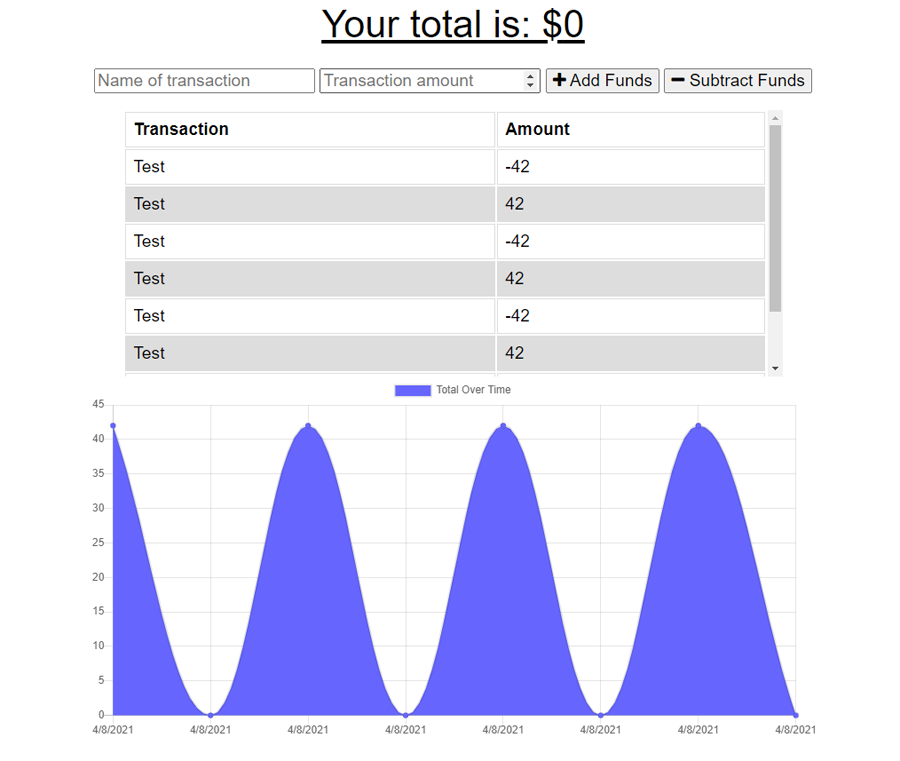

# pwa-budget-tracker
[](https://opensource.org/licenses/ISC)
## Description
A progressive web application that allows for basic tracking of a budget. A user can add and subtract funds, producing a list of past transactions as well as a chart of total budget over time. In addition, the application works offline by caching data and storing transactions in IndexedDB until it comes back online, when the transactions are uploaded in bulk.

Runs an Express server using Mongoose to handle MongoDB on the back-end. Webpack is used as a module bundler with Babel as a compiler.

## Table of Contents
* [Installation](#Installation)
* [Usage](#Usage)
* [Screenshot](#Screenshot)
* [Deployment](#Deployment)
* [License](#License)
* [Questions](#Questions)
* [Credits](#Credits)

## Installation
Install the application with
```
npm install
```

## Usage
A MongoDB server must be available. You may set it up with this environment variable:
```
MONGODB_URI = full URI to MongoDB server
```
If this value is not defined, the application will default to using a localhost database called "budget".


The server can then be run with
```
npm start
```

## Screenshot
  

## Deployment
This application has been deployed on Heroku at https://malenchite-budget.herokuapp.com/

## License  
This application is covered under the **ISC** license. More info can be found here: [ISC](https://opensource.org/licenses/ISC)

## Questions
Questions about the project? You can contact me at malenchite@gmail.com or check out my GitHub profile at [malenchite](https://github.com/malenchite)

## Credits
#### Key NPM Packages
* [@babel/core](https://www.npmjs.com/package/@babel/core)
* [express](https://www.npmjs.com/package/express)
* [mongoose](https://www.npmjs.com/package/mongoose)
* [morgan](https://www.npmjs.com/package/morgan)
* [webpack](https://www.npmjs.com/package/webpack)

Starter code was provided as part of an assignment for the UNC Coding Bootcamp.

